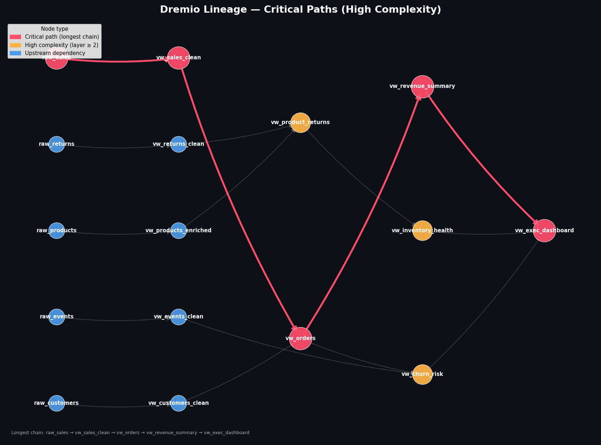
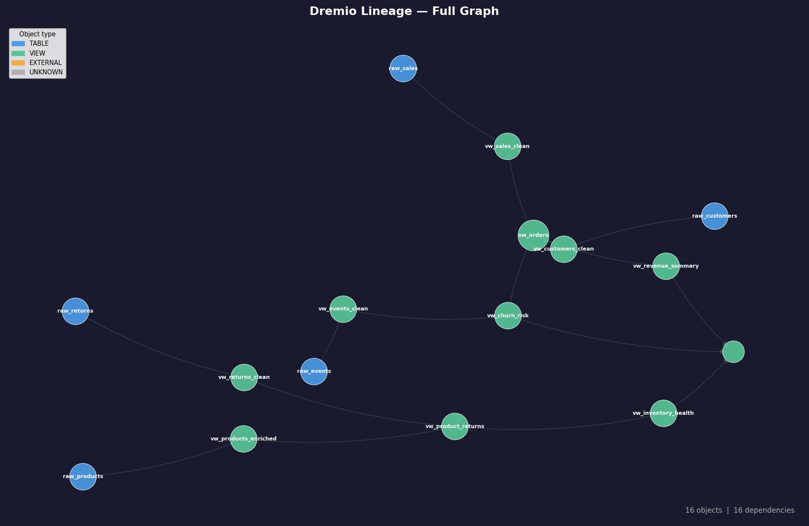

# dremio-lineage

A Python script that extracts table and view inventory, maps dependency lineage, and produces migration planning artifacts from a Dremio environment. It combines `INFORMATION_SCHEMA` SQL queries with the Dremio REST API to build a full dependency graph, then visualizes it four ways — including an interactive pan/zoom HTML graph.

Designed as a migration planning tool for teams moving from Dremio to **Databricks** (or any other target platform), but useful for any lineage audit or catalog documentation effort.

---

## Contents

- [What it does](#what-it-does)
- [Prerequisites](#prerequisites)
- [Setup](#setup)
- [Usage](#usage)
- [Output files](#output-files)
- [Visualizations](#visualizations)
- [Offline / re-render mode](#offline--re-render-mode)
- [CLI reference](#cli-reference)
- [How lineage is built](#how-lineage-is-built)
- [Troubleshooting](#troubleshooting)

---

## What it does

1. **Inventory** — queries `INFORMATION_SCHEMA.TABLES`, `VIEWS`, and `COLUMNS` for all objects in your Dremio environment (optionally scoped to a Space)
2. **SQL parsing** — uses `sqlglot` with the Dremio dialect to extract upstream references from every `VIEW_DEFINITION`
3. **REST API enrichment** — calls `/api/v3/catalog/{id}/graph` per view to capture lineage that SQL parsing may miss (cross-source joins, Nessie branches, external sources)
4. **Layer assignment** — BFS topological sort assigns every object a dependency layer (`0` = physical source, `1+` = downstream VDS); circular dependencies are flagged
5. **Migration matrix** — outputs a `migration_inventory.csv` pre-loaded with complexity scoring, upstream/downstream counts, and empty target columns for your team to fill in
6. **Visualizations** — four charts rendered automatically (see below)

---

## Prerequisites

- Python **3.10+**
- Access to a Dremio instance (Cloud or Software) with credentials
- Network access to the Dremio host on port `443` (or `9047` for Software)

---

## Setup

### 1. Clone the repository

```bash
git clone https://github.com/your-org/dremio-lineage.git
cd dremio-lineage
```

### 2. Create a virtual environment

```bash
# Create the venv
python -m venv .venv

# Activate it — macOS / Linux
source .venv/bin/activate

# Activate it — Windows (PowerShell)
.venv\Scripts\Activate.ps1

# Activate it — Windows (CMD)
.venv\Scripts\activate.bat
```

> **Tip:** You should see `(.venv)` prepended to your terminal prompt once activated. Always activate the venv before running the script.

### 3. Install dependencies

```bash
pip install -r requirements.txt
```

The `requirements.txt` covers:

| Package | Purpose |
|---|---|
| `requests` | Dremio REST API calls |
| `sqlglot` | Dremio-dialect SQL parsing for lineage extraction |
| `pandas` | Inventory and migration matrix DataFrames |
| `networkx` | Dependency graph construction and topological sort |
| `matplotlib` | Static PNG chart rendering |
| `pyvis` | Interactive HTML graph output |

---

## Usage

### Basic — full Space extraction

```bash
python dremio_lineage.py \
  --host https://your-dremio-host \
  --user admin \
  --password secret \
  --space "YourSpaceName" \
  --out ./lineage_output
```

### Full environment (no Space filter)

```bash
python dremio_lineage.py \
  --host https://your-dremio-host \
  --user admin \
  --password secret \
  --out ./lineage_output
```

### Skip REST API lineage enrichment (faster, SQL parsing only)

```bash
python dremio_lineage.py \
  --host https://your-dremio-host \
  --user admin \
  --password secret \
  --space "YourSpaceName" \
  --out ./lineage_output \
  --skip-api-lineage
```

### Skip all visualizations (data outputs only)

```bash
python dremio_lineage.py \
  --host https://your-dremio-host \
  --user admin \
  --password secret \
  --out ./lineage_output \
  --skip-viz
```

---

## Output files

After a successful run, the `--out` directory contains:

```
lineage_output/
├── lineage_graph.json            # Full node + edge graph (all objects and dependencies)
├── dependency_layers.json        # Objects grouped by migration layer
├── migration_inventory.csv       # Migration tracking matrix (open in Excel or load to Databricks)
├── lineage_full.png              # Spring-layout graph of all objects
├── lineage_layered.png           # Left→right hierarchy by migration layer
├── lineage_critical_paths.png    # High-complexity nodes with longest chain highlighted
└── lineage_interactive.html      # Interactive pan/zoom/hover graph (open in browser)
```

### `migration_inventory.csv` columns

| Column | Description |
|---|---|
| `dremio_id` | Fully qualified object ID (`schema.name`) |
| `dremio_schema` | Dremio schema / folder path |
| `dremio_object_name` | Object name |
| `object_type` | `TABLE`, `VIEW`, or `EXTERNAL` |
| `dependency_layer` | Migration order (`0` = migrate first) |
| `complexity` | `LOW` / `MEDIUM` / `HIGH` based on layer depth |
| `upstream_count` | Number of objects this depends on |
| `downstream_count` | Number of objects that depend on this |
| `upstream_dependencies` | Pipe-separated list of upstream object IDs |
| `downstream_dependents` | Pipe-separated list of downstream object IDs |
| `column_count` | Number of columns |
| `has_view_sql` | Whether `VIEW_DEFINITION` was captured |
| `target_catalog` | *(fill in)* Target Databricks catalog |
| `target_schema` | *(fill in)* Target schema |
| `target_object_name` | *(fill in)* Target object name |
| `target_object_type` | *(fill in)* `TABLE` / `VIEW` / `NOTEBOOK` |
| `migration_status` | *(fill in)* `PENDING` / `IN PROGRESS` / `DONE` |
| `sql_translated` | *(fill in)* `YES` / `NO` |
| `notes` | *(fill in)* Free text |

---

## Visualizations

### Layered graph — migration order

Objects laid out left-to-right by dependency layer. Use this to brief your team on migration sequencing — Layer 0 must be migrated before Layer 1, and so on.



---

### Critical paths — high complexity objects

Shows only objects at Layer 2 and above, plus all their ancestors. The longest dependency chain is highlighted in red — these are your highest-risk migration objects.


---

### Full graph — complete catalog overview

Spring-layout of all objects. Node size reflects the number of downstream consumers. Useful for spotting highly-referenced hub objects that need to be migrated and validated early.



---

### Interactive HTML graph

`lineage_interactive.html` opens in any browser and provides:

- **Pan and zoom** — scroll to zoom, drag to pan
- **Node hover tooltips** — shows schema, type, layer, upstream/downstream counts
- **Physics simulation** — nodes auto-arrange in a hierarchical left→right layout
- **Navigation buttons** — built-in zoom controls in the corner
- **Keyboard navigation** — arrow keys to move the viewport

To open it:

```bash
# macOS
open lineage_output/lineage_interactive.html

# Linux
xdg-open lineage_output/lineage_interactive.html

# Windows
start lineage_output/lineage_interactive.html
```

> **Note:** The interactive graph requires an internet connection on first open to load the `vis-network` library from CDN. For air-gapped environments, download `vis-network.min.js` locally and update the `<script>` src in the HTML file.

**Node shapes by type:**

| Shape | Object type |
|---|---|
| Circle (`dot`) | Physical table |
| Ellipse | View / VDS |
| Diamond | External reference |

**Node colors by layer depth** — blue (Layer 0) through red (deepest layer), matching the layered PNG colormap.

---

## Offline / re-render mode

Once you have a `lineage_graph.json` from a previous run, you can re-render all visualizations without reconnecting to Dremio. Useful for tweaking chart settings or sharing outputs with someone who doesn't have Dremio access.

```bash
python dremio_lineage.py \
  --from-json ./lineage_output/lineage_graph.json \
  --out ./lineage_output
```

---

## CLI reference

| Flag | Required | Default | Description |
|---|---|---|---|
| `--host` | Yes* | — | Dremio base URL, e.g. `https://dremio.company.com` |
| `--user` | Yes* | — | Dremio username |
| `--password` | Yes* | — | Dremio password |
| `--space` | No | *(all)* | Filter to a specific Space name |
| `--out` | No | `.` | Output directory |
| `--skip-api-lineage` | No | `false` | Use SQL parsing only; skip REST API lineage calls |
| `--skip-viz` | No | `false` | Skip all visualization outputs |
| `--from-json` | No | — | Load from existing `lineage_graph.json` and skip Dremio connection |

*`--host`, `--user`, `--password` are required unless `--from-json` is provided.

---

## How lineage is built

The script uses two complementary approaches and merges their results:

**1. SQL parsing via `sqlglot`**

Every `VIEW_DEFINITION` from `INFORMATION_SCHEMA.VIEWS` is parsed using `sqlglot` with the Dremio dialect. All `FROM` and `JOIN` table references are extracted and matched against the known object inventory. Any reference that doesn't match a known object is added to the graph as an `EXTERNAL` node (e.g., a source system table in a different catalog).

If `sqlglot` fails to parse a statement (e.g., unsupported Dremio-specific syntax), it falls back to a regex-based extractor.

**2. REST API lineage graph**

For each view node, the script calls `/api/v3/catalog/{id}/graph` to retrieve Dremio's native upstream lineage. This catches cases that SQL parsing misses — including cross-source joins where the source path isn't visible in the VDS SQL, Nessie branch/tag references, and nested parameterized views.

**3. Layer assignment**

After all edges are built, a BFS topological sort assigns each node a `layer` integer:
- **Layer 0** — no upstream dependencies (physical source tables, external references)
- **Layer N** — `max(upstream layers) + 1`

Nodes involved in circular references (rare but possible with certain Dremio configurations) are assigned **Layer -1** and logged as warnings.

